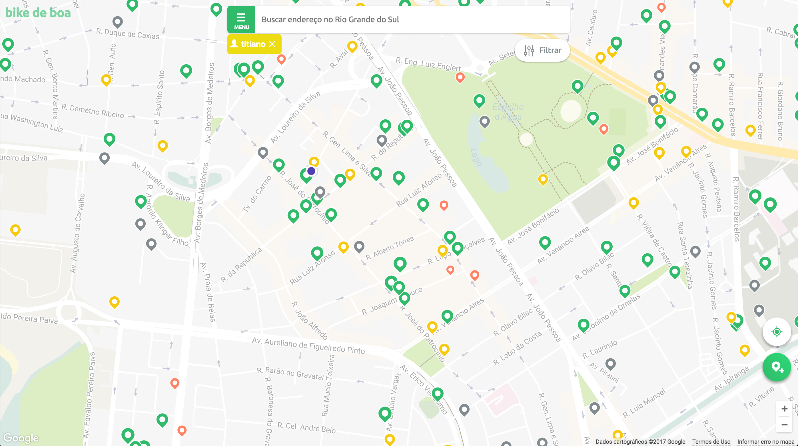
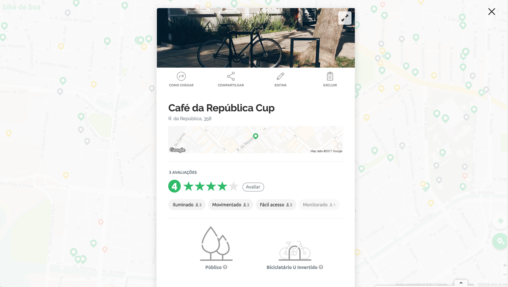
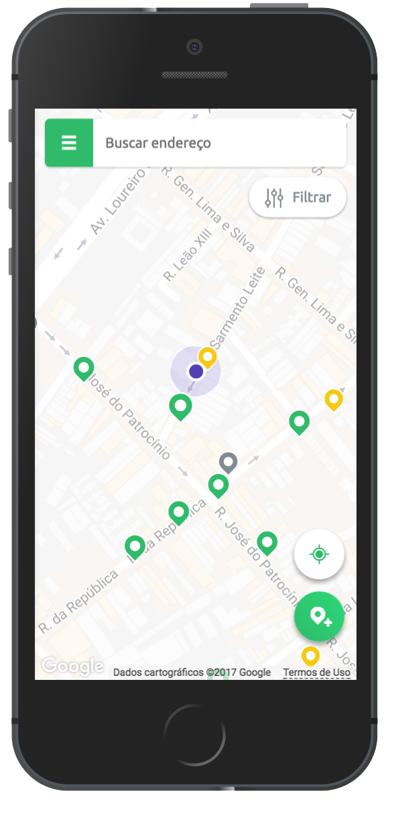
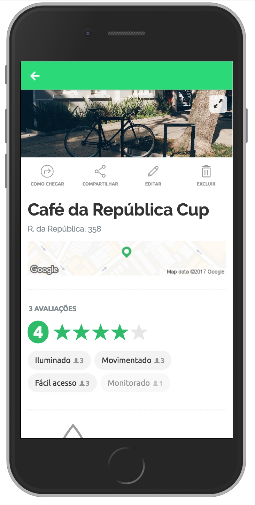

**Roles**: front-end, back-end, ux design, visual design

**Tags**: side project, nonprofit, activism, progressive web app

I wanted to contribute in some way to foster the local culture of urban biking. Analysing the many problems people face when commuting with bicycles I identified a big one that I felt could be addressed in an efficient and innovative way using technology: where to park my bike safely?

Many places already offered good structures to their clients to park their bikes, but people didn’t seem to know about them. Also there are big misconceptions on what it means to safely park a bike, so there was a big opportunity to reach people and educate them.

Our solution is an online, collaborative platform where people can map and review places to park your bike. Although the idea is simple, we’ve put lots of effort in the small details. It was important to be super easy to use to be as democratic as possible. It was also important to be a pleasant experience in overall because we're trying to educate and create new habits. Our main objects was to compel people to explore the map and the to know better their cities, as well as to contribute and express their opinion on what is available.

We back all our decisions with user interviews and extensive research for content on bike safety and urban guidelines from around the world. I started getting really active on online biking communities to reach all kinds of opinions. With that we designed a system that gives a voice for people to say how safe they feel at places and also educates them with good practices from experts.

We use web technology because it’s the most democratic platform ever. We’ve been using modern tools and concepts like Progressive Web Apps to offer great experiences from low-end to high-end Mobile and Desktop devices while still being free of friction.
 
I’ve been the main responsible for the development and the Visual and UX Design. This has been a great project to put in practice lots of concepts and ideas from my studies with User Experience. I’ve also grown to be an analytics-freak, relentlessly playing with tools, metrics and reports to understand every little microinteraction from every user. In just 6 months the web app has already been accessed by more than 1300 people and the bike parkings got more than 9000 views, even with small efforts on the marketing side and almost no media coverage.

