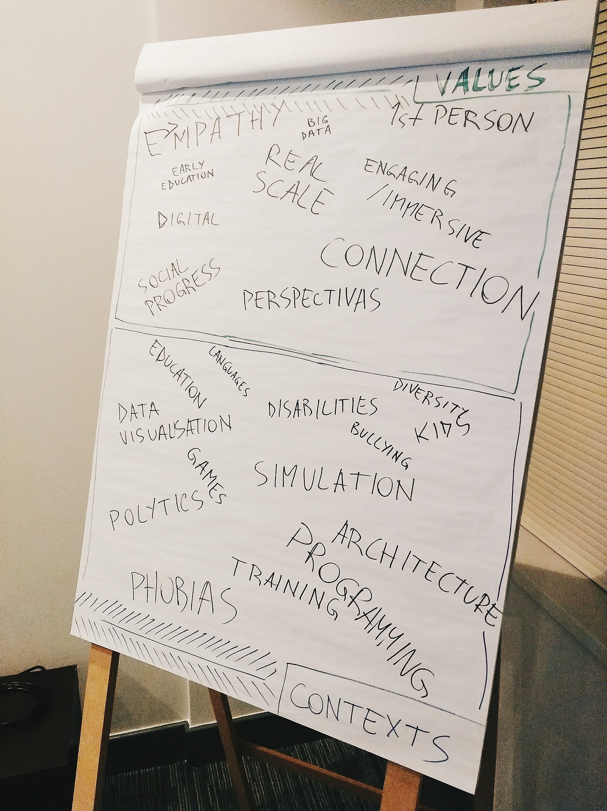
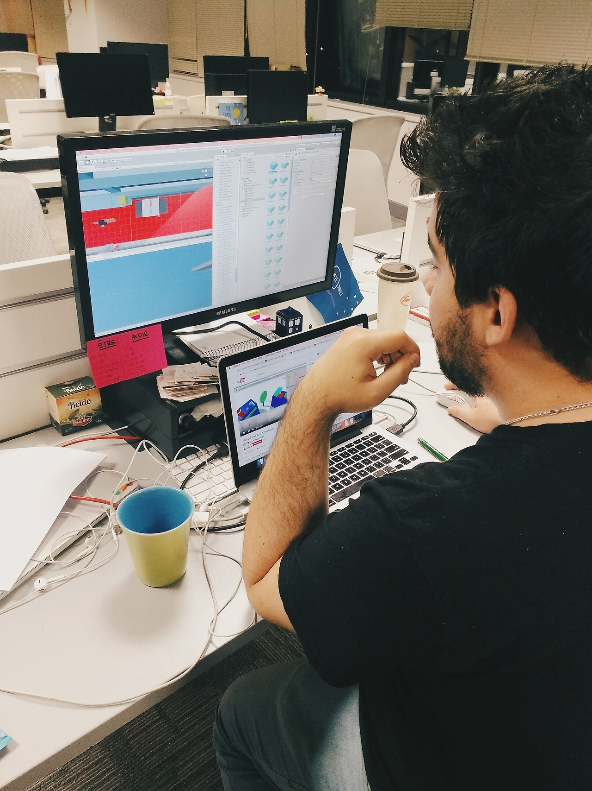
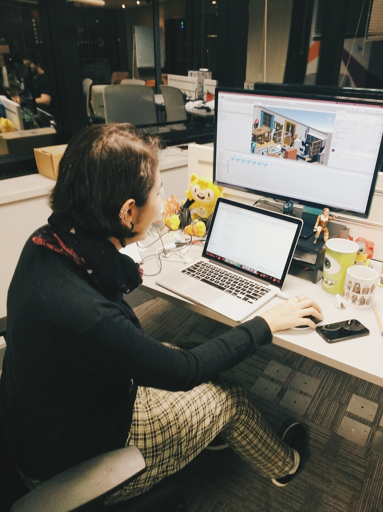
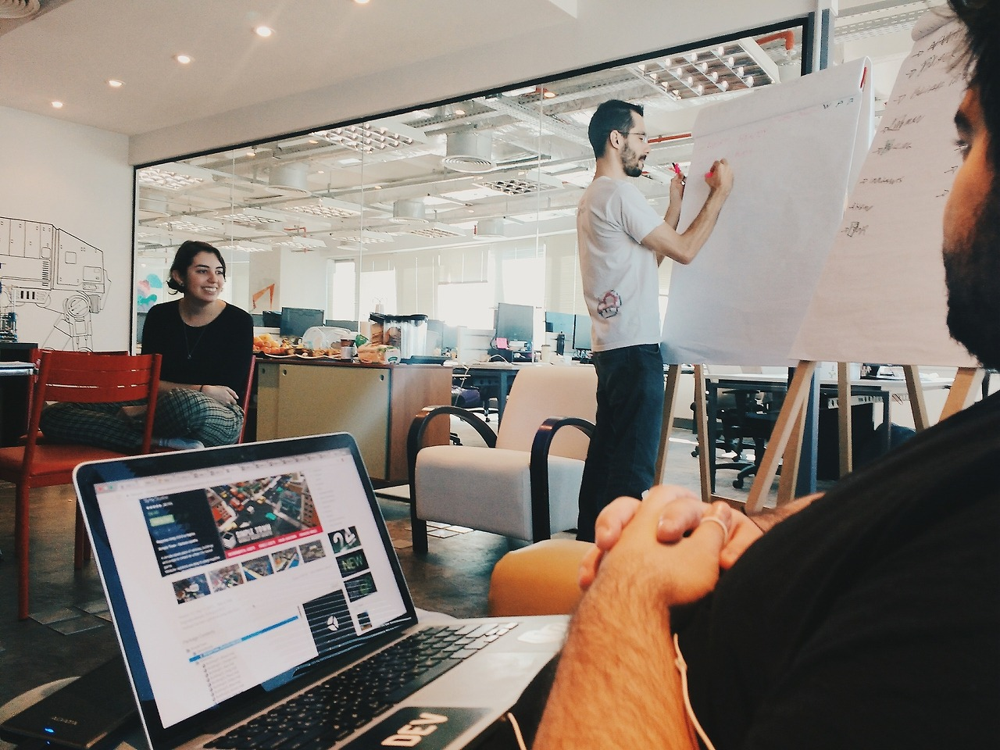
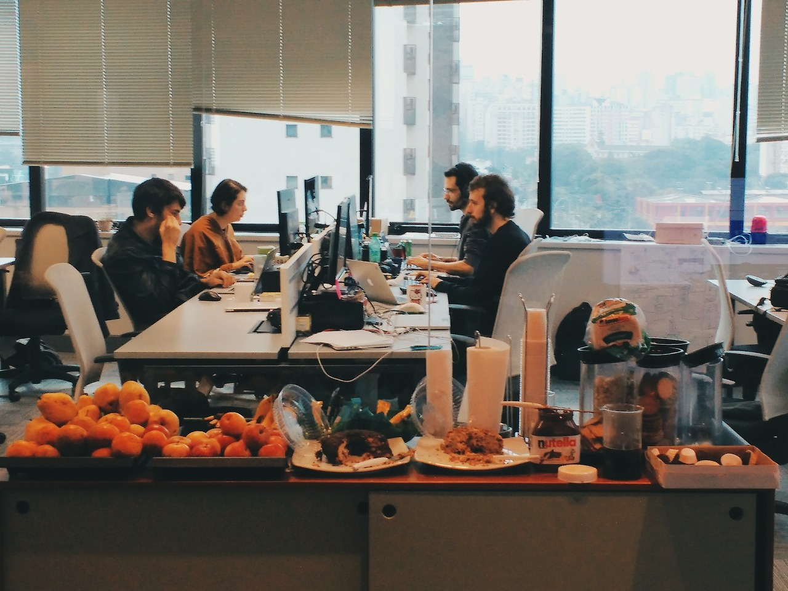

Roles: 
Tags: 

# Introduction

1st place @ Isobar Virtual Reality International Hackathon

"This group took VR to a new place by telling a story and making social commentary in a way that provided humor while also tackling a very serious and important subject. This was not just an application, it was art. Learn more about their experience here: https://thegameoflivesvr.tumblr.com"

Source: https://squeeze.isobar.com/2017/06/19/hackathon-virtual-reality/

## Challenge

To develop a VR experience with the theme “Learn by Doing”. We focused in taking advantage of platform’s potentials and unique features. Virtual Reality is an immersive platform that works to fosters empathy and social progress.

## Concept

The Game of Lives is a story in 3 chapters. Three times the same game, three times the same routine, but each time from very different perspectives. A story-telling game inspired by the best “walking simulators” that will challenge you to see the world from other people’s eyes.

## How it works
The game has a minimalistic playability with very simple mechanics. The story is told by a narrator and is permeated in dialogues and interactions with other characters. The ambiance is set by how people interact with you and also in subtle changes on how things sound and even the color palette of sunlight.

---

# Day 1
## Kick off

On Friday evening we started brainstorming by gathering the key concepts and values that VR could exploit. We also listed several interesting contexts in which it could be applied and that were of our interests. Some of the ideas we had were:

* A game for teaching a foreign language for kids using immersive visual effects and speech interaction;
* Visualization of impressive data using real scale on VR, like numbers for poverty in Brasil of deaths in wars.
* A game talking about prejudices and minorities;
* A game for raising awareness of the role of citizens in the traffic. The game would superpose the behavior of a bus driver, a car driver and a cyclist in the same street so you’d feel how others feel.
* A game where a girl should avoid catcall “shots” from people on the street.

We tried to filter out some of the ideas before leaving home, and left the best ones to decide the next day.

# Day 2
## Hands On

On the morning of the second day we were still between two project ideas:

* Telling a story for making you feel empathy for minorities and being aware of prejudices.
* Teaching languages ​​based on immersive visual and audio effects by using text-to-speech and speech-to-text technologies.

We researched for references and looked for what the Unity Assets Store had to offer us so to decide which of the options would work better with the time available. With several pros and cons for each project, we played heads or tails. The coin decided we’d be working on the first idea, which we called The Game of Lives.

During the rest of the day we found the perfect assets, we devised the basic mechanics of the game and built the skeleton of the story Script. Since we were 6 and there would be 3 scenes for each chapter we could split into doubles and create each scene in parallel: the home, the street and the workplace.

Most of us had had some experience with the Unity framework, but not enough to have a smooth experience. This firs day of development was full of technical difficulties and lots of tutorials read and videos watched. In the end of the day we had just some rough sketches of how each scene would look like.

# Day 3
## A baby was born

We only managed to glue together all the parts in the very end of this day. Most work done this afternoon was merging the work each double had done in parallel. 

There were lots of work that could be only be executed when all parts were brought together. This slowed down a little the development, but the team managed to get busy the whole time producing lots of great content. We curated the content for this Tumblr, constantly improved the script and generated all the voice files using different character voices and intonations.

We had to leave behind lots of cool ideas that we had in the beginning to make sure we’d meet the schedule. Some personas we wanted to contemplate but had to be left behind were: old people, people with physical disabilities and poor people.

In the middle of the morning we managed to have all the 3 chapters working together, and we had some time to polish the experience and add some extra little details.

# Result

