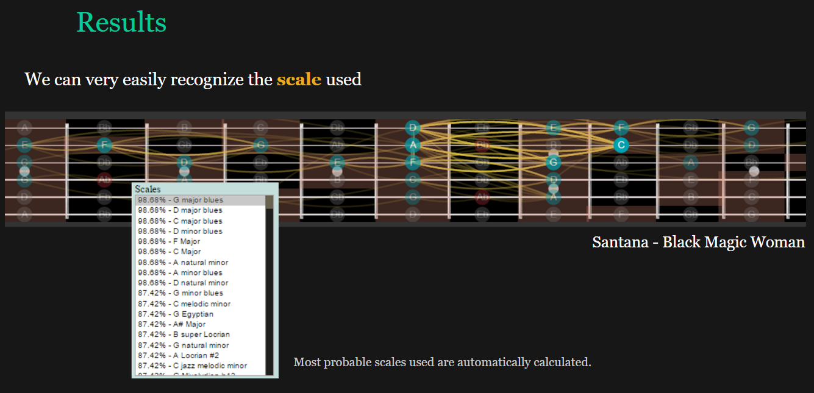
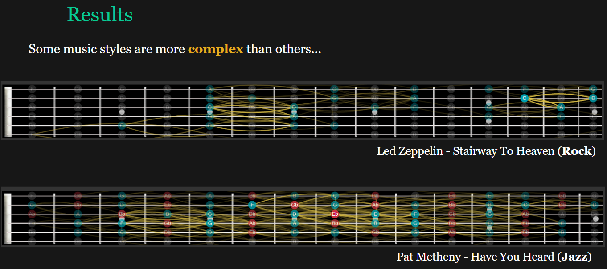
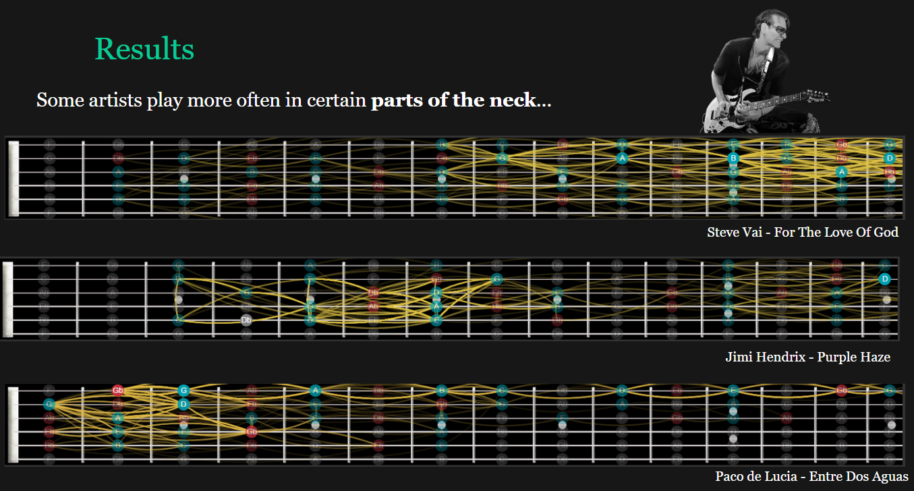

Final project for the course on Advanced Human Computer Interaction.

What if we could plot a guitar song in one single image? And what if it could at the same time be beautiful and generate interesting insights about the performer's style?

Made with web technology, including the D3.js dataviz library, and some basic music theory.

 

