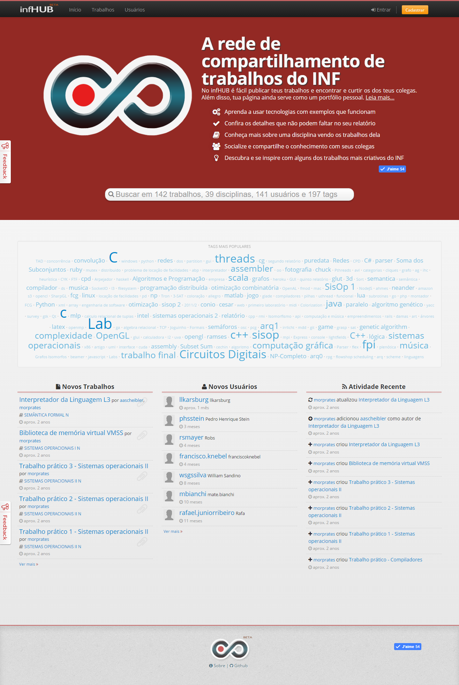
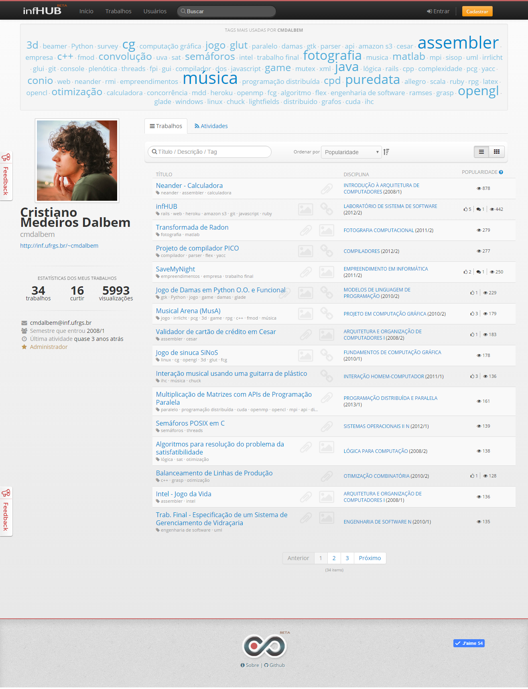
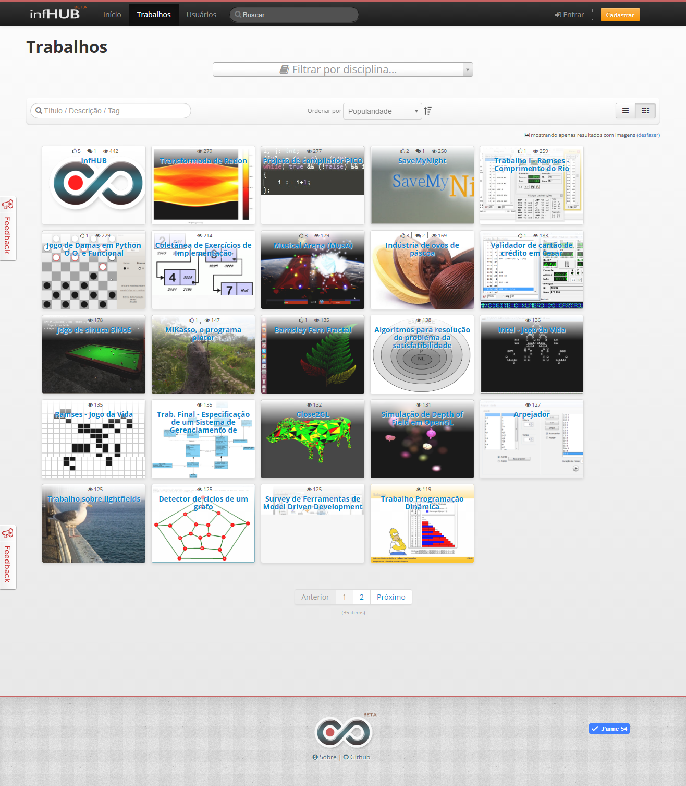
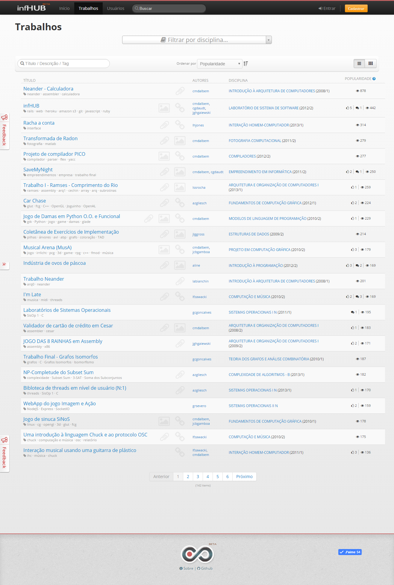
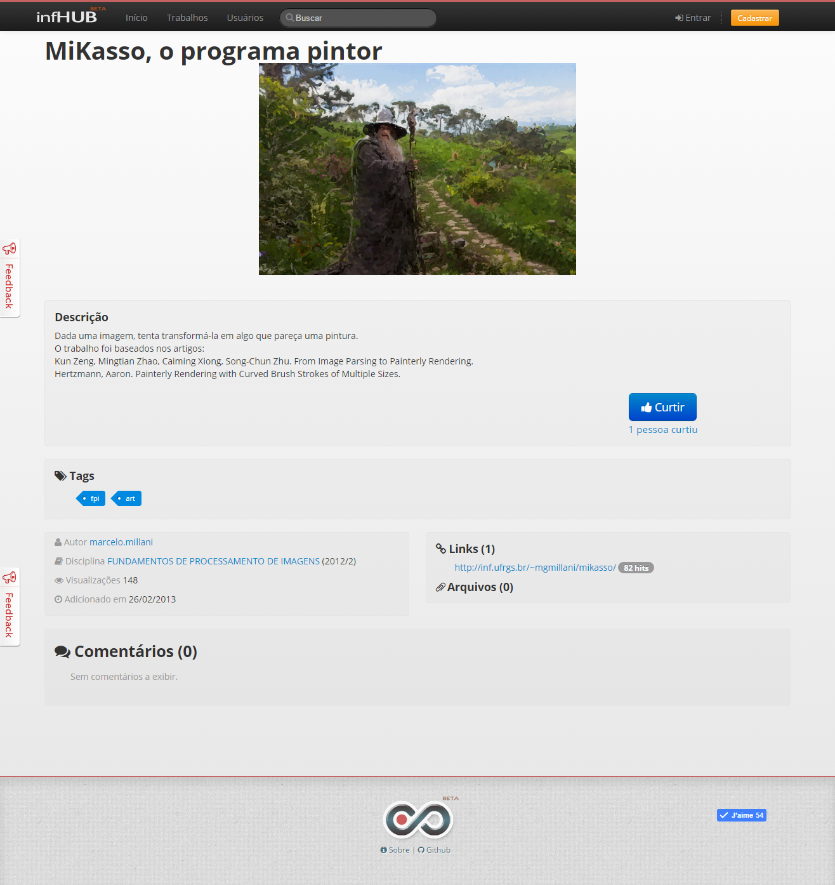

* Roles: development, design, planning
* Team: César Garcia Daudt, João Gilberto Heitor Gaiewski

## Links

https://infhub.herokuapp.com

https://github.com/cmdalbem/redetrabalhosinf

## Problem

For some time already I've been thinking how many awesome people there are in my university that I never get to see their work, just because we didn't take classes together? Everyone seemed to be so creative, and developed solutions with such high quality. Once in a while some final projects were trully masterpieces, which existence would be orally shared by students for years. "Have you seen that guy who made a kart racing game with where the racers had our teachers faces?".

Most students already had GitHub accounts, but I wanted something more, something more social and contextualized. We envisioned a platform to search and publish projects, from code to written reports, and they would be easily filtered by course and ranked by popular appreciation.

## Research

Well, there was not much user research here, I think people in Computer Science haven't heard of that yet. However this was a project that was born to satisfy our own needs and those of close friends, so it was easy targeting the user's pain points as well as ideating together to find solutions.

As benchmark we took inspiration from similar platforms, like GitHub (hence the name). We probably overlooked other platforms from that time, but to be honest we didn't document it that much.

The target audience would be any student or teacher of our University who wanted to find other peoples projects and have a easy place to host and publish his own and get noticed by the community. If everything went well, his profile page could even work as a portfolio for showing his work to potential employers.

## Development

Enlisted in the Software Systems Laboratory course, I found the perfect opportunity to implement that old idea. As part of the project we were challenged to learn from scratch web technologies and practice some Agile methods we heard about, like Scrum — all in 6 months.

I was so happy with the result that I ended up extending it beyond that semester course, and some months later we made the platform available to the students of our University.

I’ve done most of designing and development, and it was super satisfying to see it being used and appreciated for its functionalities and ease of use. The hard work resulted in more than 27,000 pageviews and 5500 unique users, and until today it's still used by the community.

It also got me more interested in Usability, and what I would find out later to be called UX. During the time I worked on this project I came in contact with two classic books that shone a light in the making of the project: "Don't Make Me Think", by Steve Krug, and "Prioritizing Web Usability", by Jakob Nielsen. The latter I ended up skimming most of the chapters, I thought it was full of great ideas however was much more formal and boring compared to the first one - which is quite a challenge, isn't it?

 

