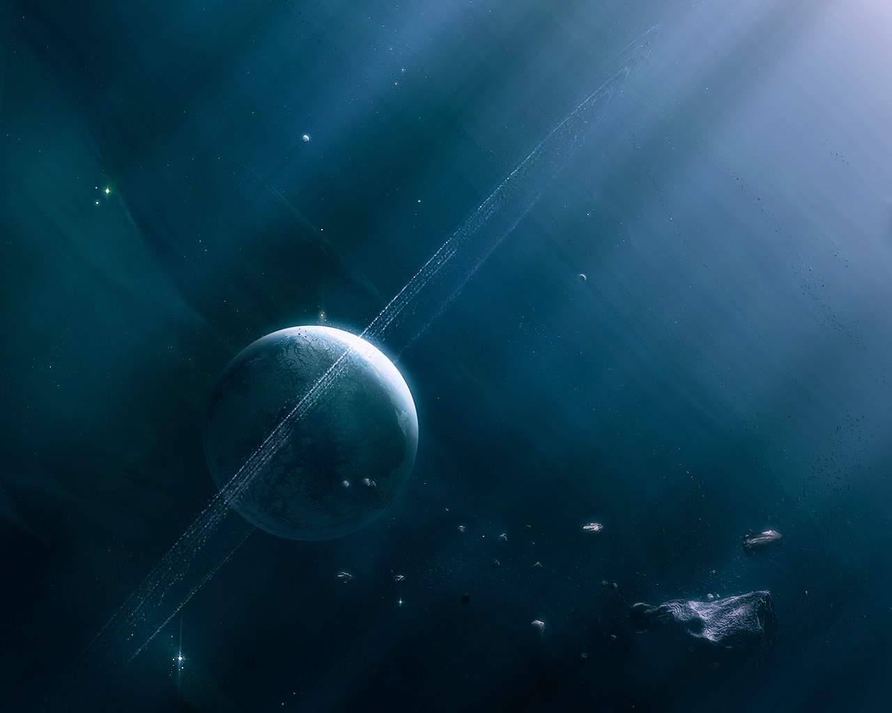
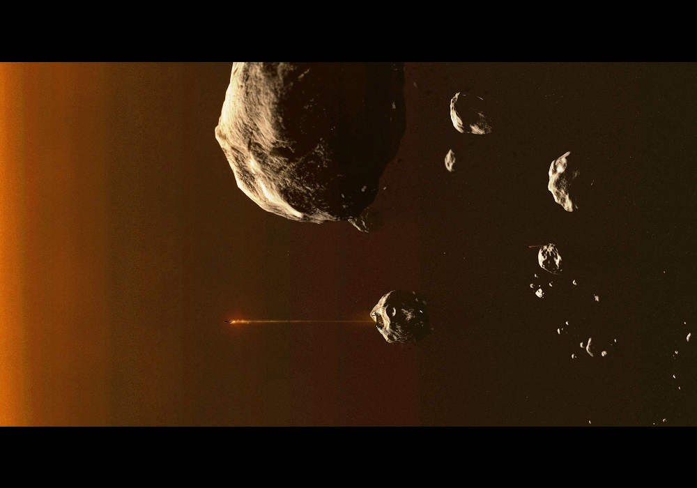
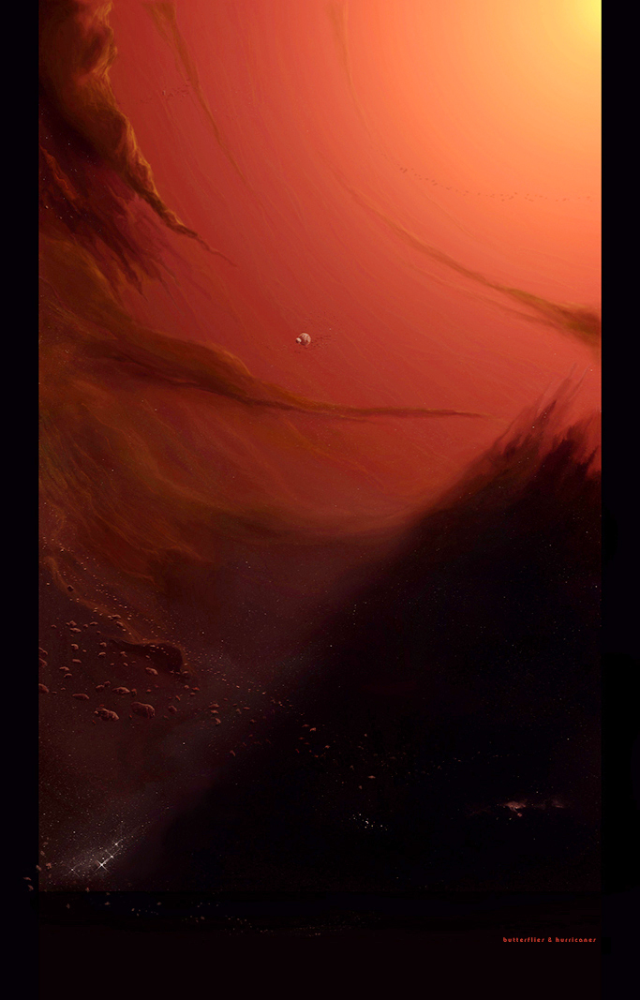
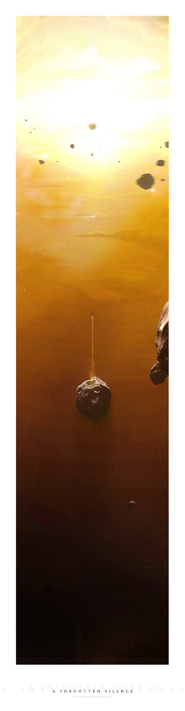

My first incursion with digital art, and probably the birth of my aesthetic self. Making space wallpapers got me started with digital design tools like Photoshop and 3D modeling software and also with a vibrant community of online artists.

I was a very active member on DeviantArt, one of the biggest online communities for digital artists. I used to heavily interact with artists from all around the world, exchanging feedback and knowledge. It proved to be a great way to become better at that. My page got more than 30,000 pageviews, and even some compliments from some famous digital space artists from that time which made me totally freak out.

 

